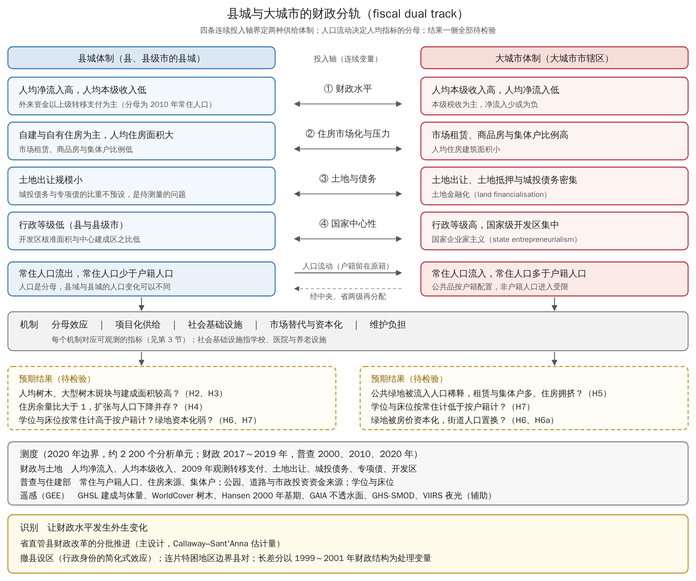

# 县城与大城市的财政分轨：财政收支、人口普查与遥感公共空间的全国县级叠加研究

研究设计报告 v1.0 ｜ 2026-09-26

## 摘要

人口流出的县是否获得了更多的人均财政资金，这些资金又是否在县城建成了更多的公共空间，目前缺少全国县级的系统证据。本研究检验研究者提出的一个命题。县城依靠上级转移支付 (intergovernmental transfers) 建起较多的公共空间和基础设施，常住人口却在流失；大城市市辖区依靠本级税收、土地出让和住房市场，公共品被流入人口摊薄，住房压力更大。2022 年的县城城镇化政策要求人口流失县城严控建设用地增量，这一命题因此也关系到县城建设的方向。文献核验要求对原命题做两处修正。大城市属于国家主导、借用市场工具的国家企业家主义体制，县城的建设资金中也可能有土地出让和城投债务。

研究以 2020 年行政区划下约 2 200 个县级分析单元为对象，把财政决算、第五至第七次人口普查、住建部城市与县城建设统计和多源遥感叠加。遥感在县城与中心城区的物理边界内测度树木覆盖、大型树木斑块和线性绿地，普查与统计年鉴补上住房压力和学校、医院等社会基础设施。两种供给体制只按投入端的四条连续轴界定，即财政水平、住房市场化与压力、土地与债务、国家中心性。分析把人均供给拆成供给量与人口两部分，比较常住与户籍两种分母，再以省直管县财政改革的分批推进为主准实验，检验人均财政净流入与公共空间供给之间的关系。v1.0 完成研究设计、数据管线与合成数据测试，尚未接入真实数据，本报告不含实证结论。

## 1 研究问题

人口流出的县人均财政净流入是否反而更高，是本研究首先要回答的描述性问题，由 H1 检验，全国格局见图 2 的人均净流入与人口变化双变量地图。即使这一格局成立，财政数字也显示不出转移支付最终形成了什么样的空间，无法区分资金用于建设公园还是支付人员工资。人均指标也无法区分供给增加与人口减少，人均值上升既可以来自分子，也可以来自分母。大城市一侧的压力同样缺少直接测度，流入人口的住房条件和学位、床位的获得多停留在推断上。

本研究用遥感和住建部统计测出公共空间的实物供给，用普查测出人口与住房，用统计年鉴测出学校、医院与养老设施，再与财政决算对齐，回答以下三个问题。

**RQ1** 在全国县级尺度上，人均财政净流入和人均本级收入（均以 2010 年常住人口为分母）如何与 2010 至 2020 年常住人口变化组合？县、县级市与各级市辖区是否在财政水平、住房市场化与压力、土地与债务、国家中心性四条连续轴上分为两群？在同一城市规模档内，这种分群是否仍然存在？

**RQ2** 控制自然本底、地形、气候与规模之后，人均财政净流入更高的单元，县城的人均树木覆盖、大型树木斑块、线性绿地与建成面积是否更多，学位与床位按常住人口计是否更充足？差异中有多少来自供给量增加，有多少来自常住人口流失？

**RQ3** 大城市市辖区的住房压力和公共品稀释有多大？流入人口在多大程度上依靠市场租赁和集体宿舍解决住房，按常住人口计的学位与床位比按户籍计低多少？新增绿地是否被小区化、被房价吸收，并伴随街道尺度的人口置换？县城的公共空间是否只有供给而少有资本化？

## 2 文献与理论位置

### 2.1 纵向财政失衡与县级转移支付

县级财政高度依赖转移支付，根源在 1994 年的分税制 (tax-sharing reform)。分税制之后，收入向上集中，支出责任留在基层，形成纵向财政失衡 (vertical fiscal imbalance)。Wong (2009) 认为，1980 与 1990 年代被动、渐进的政府收缩叠加财政投入不足，打破了政府间财政体系，并扭曲了政府机构与事业单位面临的激励。P. Zhang 和 Ren (2016) 发现大部分转移支付流向县而非市辖区。转移前县与县之间的自有收入差距大于区与区之间，转移后县际支出差距反而更小。在中西部，大量转移支付消除了原先很大的区县差距，使区与县的平均支出几乎持平。H. Li 等 (2025) 的样本中，地方政府获得的转移支付平均约为本级税收的 2.9 倍，作者指出这一均值被部分西部县的极高比值拉高。

转移支付是否均等化，取决于结构。B. Huang 和 Chen (2012) 指出规则化的一般性转移支付有均等化作用，规模更大的专项转移支付则反均等化，并易受政治影响。Y. Liu、Martínez-Vázquez 和 Wu (2017) 用 1995 至 2009 年县级面板发现，省以下财政分权扩大了省内不平等，省级政府的均等化努力可以缓解这一效应。F. Liu 和 Hu (2025) 用 2016 至 2021 年县级数据发现，均等化转移支付促进小县增长，却抑制大县增长。

转移支付能否变成可见的公共设施，证据并不一致。Guo (2008) 发现一般性转移支付显著扩充了县政府供养人员。Yu、Wang 和 Tian (2016) 在县级教育支出中发现反粘蝇纸效应 (anti-flypaper effect)。Q. Zhang 等 (2014) 对 1995 至 2008 年城市热点县的研究发现，越依赖中央转移支付的县，耕地转为城市用地越少。这些发现是第 4 节对立假说 R1 的依据。

行政区划调整改变了县的财政身份，文献对其效果的判断方向不一。P. Li、Lu 和 Wang (2016) 同名工作论文的摘要显示，省直管县 (province-managing-county) 提高了县级收入与转移支付，但管理幅度扩大削弱了上级的协调与监督，县的经济绩效随之下降。Ma 和 Mao (2018) 则发现改革提高了县级增长和基础设施支出。Y. Liu 和 Alm (2016) 发现改革城市经由扩大土地出让提高了增长。Tang 和 Hewings (2017) 发现 2000 至 2004 年的撤县设区 (county-to-district conversion) 促进了地方经济发展，交通基础设施改善与集聚经济是可能的渠道。J. He (2024) 则发现原县在合并后表现变差，并将其归因于行政自主权的丧失。撤县设市并未改善增长与公共服务 (Fan et al., 2012)，只有升格为地级市才带来人口与财政收入增长 (J. Wang & Yeh, 2020)。撤县设市没有改变财政层级，升格为地级市才改变，因此县与县级市属于同一财政层级，市辖区属于另一层级。

### 2.2 人口收缩与县城城镇化

普查口径的研究一致显示，快速城镇化与大范围人口收缩同时发生，而且收缩在加速。Long 和 Wu (2016) 用 2000、2010 年普查常住人口发现，约一半乡镇街道人口减少。X. Meng 和 Long (2022) 用第六、七次普查识别出 1 507 个收缩区县，占全部区县的 52%。Y. Zhang 等 (2024) 在 2 846 个县级单元中识别出 2010 至 2020 年的 1 050 个收缩单元，集中在东北、华北、中部和西北。H. Li 和 Mykhnenko (2018) 指出，以户籍统计城市人口会计入已经离开的人，漏掉没有本地户口的常住者。Z. Yang 和 Dunford (2018) 发现，总人口、城镇人口与户籍人口的流失在不同城市以不同组合出现。本研究的人均指标因此尽量以常住人口为分母，县城人口的例外见第 7 节。

县域收缩不等于县城收缩。H. Zhang、Chen 和 Chen (2022) 认为，县域城镇化是就近城镇化的主要形式，教育、医疗等高等级公共服务只能在县城和中心镇提供。L. Chen、Li 和 Huang (2025) 发现教育正在成为人口向县城集中的新动力。县域总人口下降与县城人口上升可以同时发生，所以命题必须在县城建成区尺度检验。

人口流失地区还存在建成空间超前扩张的现象。Jin 等 (2017) 用住宅项目、兴趣点与位置服务数据识别出 30 个鬼城 (ghost cities)，新城区平均活力只有老城区的 8.8%。Zheng 等 (2017) 在长三角用夜光、土地覆盖与人口格网构建鬼城指数，发现县和新开发区的风险更高。X. Zhang 等 (2023) 发现部分城市出现人口流失、经济衰退与用地扩张并存的悖论。Jin、Sun 和 Du (2026) 发现 2000 至 2021 年县级城镇人口与城市建设用地都在增长，但城镇人口增长始终滞后于用地扩张。2003 年后建设用地指标向内陆倾斜，指标减少的城市房价比指标增加的城市涨得更快 (L. Han & Lu, 2017)。S. He 等 (2026) 对山东乳山的研究显示，住房需求收缩与国家推动紧凑发展的战略使这座沿海小城市进入慢增长期。季节性投资型居民与游客带来暂时密度 (transient density)，他们季节性、碎片化的使用使开发不完整且缓慢。Moss (2008) 对原东德供排水系统的研究显示，用水量骤降与统一后的设施扩张叠加，形成慢性产能过剩，加剧了服务质量与价格的空间不平等。

转移支付是一种地方导向政策 (place-based policy)。空间均衡视角认为，补贴贫困地区的收益会被更高的价格抵消，主要的实际效果是把人引向或留在低生产率地区 (Glaeser & Gottlieb, 2008)。Kline 和 Moretti (2014) 用空间均衡模型讨论了这类政策的受益者与全国净收益。Austin、Glaeser 和 Summers (2018) 发现，在历史上非就业率高的地区，劳动需求增加对就业的拉动更大，在这些地区定向补贴就业可能降低非就业。对于收缩地区的规划回应，Hollander 和 Németh (2011) 提出精明收缩 (smart decline) 的正义维度。

日本提供了一个制度上可比的参照。地方交付税 (local allocation tax) 按各市町村的服务成本与收入能力差异计算，分配向人口过疏的市町村倾斜。Kajita (2001) 的统计显示，过疏市町村的人均地方税低于全体市町村平均，计入地方交付税与国家、都道府县的专项拨付后，收入差距反转。过疏市町村的人均总支出是全体平均的 1.88 倍，人均公共工程资本支出是 2.33 倍，公共投资是两类转移资金最偏重的领域。人口继续减少后，设施存量转为负担。2014 年总务省要求各市町村编制公共设施综合管理计划并设定削减目标，而 2013 年全国 1 744 个市町村中只有 4.0% 完成了公共设施重组计划 (Nishino, 2015)。立地适正化计划 (location normalization plan) 则是把医疗、福利等城市功能引导到中心区的规划框架，地方城市的公共设施也在中心区内重组 (Musha, 2021)。转移资金支撑过疏地区的公共投资，设施随人口减少需要削减，政策再转向集中，这一顺序与县城命题平行。2022 年县城城镇化意见要求人口流失县城盘活存量、促进公共服务资源适度集中，对应的正是日本的第三步。

### 2.3 大城市的土地财政 (land finance)、国家企业家主义与住房压力

原命题中“大城市靠市场”一说需要修正。L. Han 和 Kung (2015) 发现企业所得税分成下降后，地方政府把努力从扶持工业转向房地产和建筑业。Lichtenberg 和 Ding (2009) 把地方官员描述为土地开发商。Tao 等 (2010) 揭示地方以补贴性土地与基础设施竞争制造业投资。2008 年后土地进一步金融化，土地抵押、城投平台 (local government financing vehicles) 与城投债成为开发融资渠道 (F. Wu, 2022)。F. Wu (2018) 用国家企业家主义 (state entrepreneurialism) 概括这一体制，即规划中心性与市场工具的结合。县城一侧同样不只依靠转移支付。Z. Li、F. Wu 和 Zhang (2024) 对 2009 至 2020 年 300 余个城市的分析发现，欠发达城市的债券发行与财政收入之比更高、金融风险更大。由此推断，县城基础设施中可能也有相当部分来自城投债务。

大城市的压力集中在流入人口身上。Glaeser 等 (2017) 记录了 2003 至 2014 年房价年均实际涨幅超过 10% 与住房空置增加并存。Fang 等 (2016) 发现最低收入的按揭购房者房价收入比超过 8。Logan、Fang 和 Zhang (2009) 用 2000 年普查八个大城市的数据发现，户籍与居住身份影响住房获取路径，农村流动人口无论居住多久都处于劣势。Y. Liu 等 (2010) 说明城中村 (urban villages) 以非正规租赁为流动人口提供低成本住房。Sieg、Yoon 和 Zhang (2023) 的结构模型表明，流动人口为流入城市提供正向财政外部性 (positive fiscal externalities)，自身却没有获得同等公共服务。Henderson 等 (2022) 发现地方官员操纵土地配置推高房价，并带来形象工程式的公共基础设施投资。

### 2.4 公共空间的资本化与绿色绅士化

何深静 (Shenjing He) 的系列研究把大城市的环境美化与基础设施投资视为绅士化 (gentrification) 的机制。S. He (2007) 发现上海的国家资助型绅士化 (state-sponsored gentrification) 通过大量投资环境美化和基础设施，为资本循环创造条件，代价是大规模居民置换 (displacement)。S. He 和 F. Wu (2009) 把城市更新看作中国新自由主义化的前沿。S. He (2019) 把 2010 年以后界定为国家主导金融化下的第三波绅士化。S. He、Zhang 和 Wei (2020) 分析了棚户区改造的国家主导金融化逻辑。Zhu、He 和 Hao (2022) 记录了上海郊野公园规划引发的流动租户清退。S. He 和 Cai (2024) 发现教育型封闭小区 (gated communities) 把学位打包进小区服务，使教育由公共品变为可被房价资本化的俱乐部品 (club goods)。这些研究意味着，大城市新增的公共空间可以被小区化，也可以被房价吸收，因而不是中性的公共品供给。

绿色绅士化 (green gentrification) 文献提供了可检验的机制。Wolch、Byrne 和 Newell (2014) 指出新增绿地可能抬高房价与物业价值并引发置换，并把中国纳入比较。Anguelovski 等 (2019) 梳理了绿色绅士化的研究议程。L. Wu 和 Rowe (2022) 用北京的特征价格模型 (hedonic price model) 与双重差分 (difference-in-differences) 证实，新公园推高了周边房价。J. Zhang 和 L. Wu (2025) 在全国城市尺度发现，NDVI 上升与新建公园都可引致绅士化。

检验这一机制需要区分市场供给与公共供给。Xiao、Li 和 Webster (2016) 发现上海封闭小区的俱乐部绿地替代了公共绿地，区级公园对购房者没有可测的使用价值。W. Y. Chen 和 Hu (2015) 用 285 个地级市面板发现，土地财政依赖与公共绿地面积负相关。Chung、Zhang 和 F. Wu (2018) 对珠三角绿道的研究说明，绿道为何建、建在哪里、怎么建，受市级用地指标、农村用地权属与房地产开发三者交织的影响。Latham 和 Layton (2019) 的社会基础设施 (social infrastructure) 概念提醒，公共空间的价值在于可进入与被使用，遥感测得的绿量只是供给侧的数量代理。

### 2.5 用遥感测度公共空间

人口加权绿地暴露 (population-weighted greenspace exposure) 已成为比较城市绿地的标准框架。B. Chen 等 (2022b) 发现全球南方城市的绿地暴露约为北方城市的三分之一。S. Wu 等 (2023) 用 2000 至 2018 年 Landsat 时序发现暴露不平等普遍下降。B. Chen 等 (2022a) 在省、市、县、镇、地块五个尺度评估中国的绿地暴露，发现覆盖率与暴露并不一致，新城区的暴露好于老城区。

建成边界与建设强度已有可用的长时序产品。GAIA 提供 1985 至 2018 年逐年不透水面 (Gong et al., 2020b)，全球城市边界 GUB 由 GAIA 派生 (X. Li et al., 2020)。GHSL 2023 版提供建成面积、建筑体量与人口格网 (Pesaresi et al., 2024)，GEE 上的序列为 1975 至 2030 年每五年一期（附录 D）。CBRA 与 CNBH-10 m 提供中国的建筑屋顶面积与高度 (Z. Liu et al., 2023; W. Wu et al., 2023)。绿地一侧缺少同样长的一致序列。CLCD 用 GEE 上 33 万余景 Landsat 影像生成中国 30 m 年度土地覆盖，论文版覆盖 1990 至 2019 年，总体精度为 79.31% (J. Yang & Huang, 2021)。Hansen 等 (2013) 的全球森林变化产品以 30 m 分辨率记录 2000 年以来的森林损失与增加，其 2000 年树冠覆盖度可作为树木存量的基期。

土地覆盖产品各有偏差。Venter 等 (2022) 发现，与 Dynamic World 和 Esri 相比，ESA WorldCover 偏向高估草地；三套产品的草地类精度只有 34%，树木类为 81%，本研究因此以树木类为主口径。Bai 等 (2018) 以 2000 年乡镇普查检验 GPW、GRUMP、WorldPop 与 CnPop，WorldPop 精度最高，但在横断山等丘陵山地误差较大；该研究未评估本研究使用的 GHSL 人口格网 GHS-POP。OpenStreetMap 的道路完整度与人口密度呈 U 形关系 (Barrington-Leigh & Millard-Ball, 2017)，县城可能恰好处在最容易缺失的中等密度区间，需以分层抽样核验确认。中国 OSM 质量也存在显著的市级差异 (C. Han et al., 2025)。

### 2.6 研究空白

已有研究分别解释了县级转移支付的分配、人口收缩的格局和大城市的绿色绅士化。缺少的是在全国县级尺度上同时观测财政来源、常住与户籍人口、住房和公共空间实物供给的研究。财政研究多止于支出数字，收缩研究多止于人口与建设用地，绿地研究多在地级市尺度，并以统计口径的绿化覆盖率为因变量。本研究的贡献有三点。其一，以县城和中心城区的物理边界测度公共空间，并把人均供给拆成供给量与人口两部分，使设施多而人少这一判断可以分解检验，回应收缩城市与精明收缩的讨论。其二，只用投入端的连续变量界定两种供给体制，把住房市场化、土地与债务和国家中心性纳入对所有单元的测度，使国家企业家主义的判断可以在县与市辖区之间比较，而不依赖行政身份。其三，以省直管县财政改革的分批推进为主准实验，改革前后县仍在同一套年鉴中，第一阶段的财政变化可以逐年观测，撤县设区只作为行政身份的简化式效应。由此，财政分权与转移支付的讨论从支出数字延伸到支出形成的空间与服务对象。

## 3 概念框架

研究者提出的原命题是“县城拿转移支付、基建更好但人少，大城市靠市场、压力更大”。第 2 节的文献要求对它做两处修正。大城市属于国家企业家主义体制 (F. Wu, 2018)，并非单纯依靠市场。县城的建设资金也不只有转移支付，可能同样依赖土地出让与城投债务，转移支付本身还可能被人员经费吸收。

本研究因此用四条连续轴界定两种供给体制 (supply regime)，每条轴只描述投入与制度条件，不含任何待检验的结果（图 1）。财政水平指人均财政净流入与人均本级收入，分母都是 2010 年常住人口。住房市场化与压力指市场租赁户、商品房户、自建房户与集体户人口的比例，以及人均住房建筑面积。土地与债务指人均土地出让价款、人均城投有息债务与人均新增专项债。国家中心性 (state centrality) 指行政等级，以及国家级、省级开发区核准面积与中心建成区面积之比。县城体制位于人均净流入高、本级收入低、住房以自建和自有为主、行政等级低的一端，大城市体制位于另一端。县城在土地与债务轴上的位置不事先设定，县城建设对债务的依赖正是需要测量的问题。各类单元在四条轴上是否真的分为两群，由 H1 检验，不按行政身份事先指定。下文把县的县城与城市的中心城区统称为中心建成区 (core built-up area)，识别方法见 8.1 节。

从投入到结果有五个机制，结果一侧的判断都待检验（图 1 下部）。分母效应 (denominator effect) 指人口流失本身抬高人均供给，用分子与分母分开的回归、三种分母和以 2010 年人口为基础的反事实分母识别。项目化供给机制 (project-based provision) 指专项转移支付、土地出让与城投资金落地为可见的绿地、道路与新区，用住建部的设施实物量与投资资金来源、新增树木和建成面积识别。社会基础设施机制指县级一般公共预算中规模很大的教育与卫生支出形成学校、医院与养老设施。县城一侧可能出现与公共空间相同的分母效应，大城市一侧则是非户籍人口的入学与就医约束，用常住与户籍两种口径的学位与床位识别。市场替代与资本化机制 (market substitution and capitalization) 指大城市的绿地部分由小区供给并被房价吸收，用小区内外的绿地拆分、房价和街道尺度的人口置换识别。维护负担机制 (maintenance burden) 指收缩地区的存量设施与住房利用不足，用住房余量比识别，单位建成面积夜光作辅助。

政策本身已经预设了维护负担机制。2022 年《关于推进以县城为重要载体的城镇化建设的意见》把县城分为五类。对人口流失县城，该意见要求严控城镇建设用地增量、盘活存量，促进人口和公共服务资源适度集中。本研究的遥感与住房测度可以逐县检验这一政策判断是否符合实际。

## 4 研究假设

**H1 类型分化。** 县、县级市与各级市辖区在四条投入轴上分为两群。县与县级市集中在人均净流入高、本级收入低、住房市场化程度低、行政等级低的一端，超大、特大城市市辖区集中在另一端。在同一城市规模档内，县级市与市辖区的差别仍然存在，说明分群来自财政层级而非规模。2010 与 2020 两期结论一致。人口一侧另设县域收缩、县城增长一类，即单元常住人口下降而中心建成区人口上升，预期这一类主要出现在县与县级市。

**H2 人均供给。** 控制自然植被本底、地形、气候、区位与中心建成区人口规模后，人均财政净流入越高，县城的人均树木覆盖、人均大型树木斑块、人均新增树木、住建部口径的人均公园面积与人均建成面积越高。土地出让、城投债务与专项债作为与转移支付并列的资金来源进入同一模型，以免把土地与债务资金的作用归于转移支付。

**H3 分母效应。** 分子与分母分开后，中心建成区树木面积与建成面积对中心建成区人口的弹性小于 1，人口越少的单元人均值越高。H2 中的正相关在人口收缩的单元中更强。用以 2010 年人口为基础的反事实分母重算后，常住人口下降的单元实际人均值高于反事实值，二者的对数差即分母效应。弹性检验使用中心建成区人口的变化，不只用县域人口的变化。

**H4 住房余量。** 人均财政净流入高且人口收缩的单元，住房余量比更高，即遥感估算的住宅建筑面积超出普查家庭户实际使用的住房面积。这些单元中心建成区扩张与常住人口下降并存的比例也更高。单位建成面积夜光只作辅助证据。

**H5 住房压力与稀释。** 常住与户籍人口之比越高、人均本级收入越高的单元，市场租赁户比例和集体户人口比例越高，人均住房建筑面积越低，按常住人口计的人均公共绿地越低。这些指标来自第七次人口普查，H5 现在即可检验。住房压力同时属于第 3 节的住房轴，H5 检验的是这条轴与财政轴、人口流入是否同向变化。小区内俱乐部绿地占全部绿地的比例需要小区边界，在广东试点补充。

**H6 资本化差异。** 绿地增加在大城市显著推高周边房价，在县城的资本化弱。县城房价只能依靠商业平台的挂牌数据，特征价格模型先在广东试点检验可行性，全国检验放在 v2.0。

**H6a 街道尺度置换。** 在超大、特大城市与大城市的中心建成区内，2010 至 2020 年绿化增量大的街道，人户分离人口与租户的比例下降更多；县城街道没有这一关系。检验只用分乡镇街道普查与遥感，不依赖房价（9.7 节）。

**H7 社会基础设施。** 人均净流入高、人口流失的县，每千名常住人口的床位与在校生比例更高，并随常住人口流失而上升，这是社会基础设施一侧的分母效应。人口流入的城市按常住人口计的床位与学位偏低，非户籍儿童的入学受到约束，以在校生与 0 至 14 岁常住人口之比近似。同一床位数按常住与户籍人口计算的两个比值之比，恒等于户籍人口与常住人口之比，只作描述。

对立假说 **R1** 由 Guo (2008) 与 Q. Zhang 等 (2014) 推出。前者发现一般性转移支付扩充了县政府供养人员，后者发现越依赖中央转移支付的城市热点县，耕地转为城市用地越少。据此，转移支付主要被人员经费和一般公共服务支出吸收，与人均公共空间无关甚至负相关。R1 用支出结构直接检验，即工资福利支出占比与一般公共服务支出占比是否随人均净流入上升，数据取广东县级决算。H2 与 R1 的预测方向相反，二者在同一模型中竞争。土地与债务作为并列渠道进入模型后，公共空间的增加不会被全部归于转移支付，二者的对决才有意义。各假设对应的指标、模型、输出文件、预期符号与实现版本见表 3（9.8 节）。

## 5 研究单元与分组

研究以 2020 年行政区划为统一边界，财政、普查、住建部统计与遥感数据全部统一到这一边界。2020 年底全国有 2 844 个县级行政区，其中市辖区 973 个、县级市 388 个、县 1 312 个、自治县 117 个、旗 49 个、自治旗 3 个、特区 1 个、林区 1 个。分析单元按财政层级分为两类。第一类是城市市辖区单元 (city proper)，把同一地级及以上城市的全部市辖区合并为一个单元，与《中国城市统计年鉴》的市辖区口径对应。东莞、中山、儋州、嘉峪关等不设区的地级市也归入此类。第二类是县和县级市，每个行政区为一个单元。自治县、旗、自治旗、特区和林区按县处理，省直辖县级行政单位按其建制归类。合并后全国约有 2 200 个分析单元。

每个单元内再识别一个中心建成区，即县的县城和城市的中心城区。遥感公共空间指标在中心建成区内统计，财政与人口指标在单元全域统计。这样做可以避免县域内大片林地和农田虚增县城的人均绿地。

2000 年后撤县（市）设区的区，按 2020 年边界并入所属城市的市辖区单元。这一选择使截面分析与《中国城市统计年鉴》口径一致，代价是市辖区单元混入了大片原县域。每个市辖区单元因此记录撤县设区的区数，以及这些区在 2020 年常住人口中的占比 (conv_pop_share_2020)。v1.1 把占比加入控制变量，并在稳健性检验中剔除占比高的单元。历年数据按代码对照表统一到 2020 年边界。某县在 y 年仍是县、之后才并入市辖区时，该县 y 年的财政数加到所属城市 y 年的市辖区合计上。被撤县设区的多是近郊、增长较快的县，按 2020 年状态分组会带来选择问题，长差分因此在 v1.1 加报按 2010 年状态分组的结果。

重庆的市辖区包含大面积农村地区，本研究只把主城九区合并为中心城区单元，其余 17 个区单列为外围市辖区。《中国城市统计年鉴》只给出重庆全部市辖区的合计，与主城九区单元的口径不一致。研究者从《重庆统计年鉴》分区县表逐区录入财政，并在 config.yaml 的 district_level_fiscal_prefs 中登记重庆后，主城九区与外围区各用自己的财政数。未登记时，重庆标记为财政口径不一致，不进入主回归。其他城市有区级财政数据时，可按同样方式处理。北京、天津、上海、重庆四个直辖市的市辖区财政含省级职能支出，以行政等级变量标出，并在稳健性检验中剔除（表 2）。新疆生产建设兵团城市 (6590xx) 的财政属兵团体系，保留在地图中，不进入表格与模型。

城市规模分级推广到全部单元。市辖区单元按城区常住人口套用国发〔2014〕51 号的城市规模标准，城区人口取自 2020 年版《中国人口普查分县资料》表 1，该资料系统发布了 683 个城市的城区人口。县级市也用这一来源，县用住建部县城人口加暂住人口，按同一标准分级。行政类型与规模交叉形成交叉分组 (admin_size_group)，用来在同一规模档内比较县级市与市辖区，以分离财政层级与城市规模、密度的作用。03 已输出这一分组，按它汇总的比较表在 v1.1 实现。描述统计另保留五类分组，即超大特大城市市辖区、大城市市辖区（Ⅰ型与Ⅱ型）、中小城市市辖区、县级市和县。超大与特大城市以第七次全国人口普查公布的名单为准。超大城市 7 个（上海、北京、深圳、重庆、广州、成都、天津），特大城市 14 个（武汉、东莞、西安、杭州、佛山、南京、沈阳、青岛、济南、长沙、哈尔滨、郑州、昆明、大连）。按住建部《2022 年城市建设统计年鉴》口径，东莞、武汉、杭州的城区人口已超过 1 000 万，苏州自 2023 年起进入特大城市，稳健性检验将改用这一口径。昆山、义乌、慈溪、晋江四个县级市的城区人口已达Ⅱ型大城市标准，稳健性检验中把它们单列。

准实验另用一套不合并的县级单元层 (units_did)。每个 2020 年县级行政区单独成为一个单元，单元代码为 6 位行政区划代码，驻地点另成一表。撤县设区的原县在这一层中保留自己的县城斑块与年度遥感序列，省直管县与连片特困地区的处理单元也在这一层上定义。遥感提取在同一管线中以准实验单元模式运行，结果与主单元层分开存放。

## 6 数据

数据分为财政、土地与债务、人口与住房、住建部统计与社会事业、遥感五类，来源、口径与可信度的逐项核验见附录 B，GEE 数据集核验见附录 D。

**财政。** 县与县级市的一般公共预算收入与支出取自《中国县域统计年鉴（县市卷）》，市辖区合计取自《中国城市统计年鉴》市辖区口径。核心财政变量是两个水平量，即人均净流入（支出减收入）与人均本级收入，分母都取 2010 年常住人口，使财政变量不随此后的人口变化机械变动。财政自给率只作描述，比值口径只在稳健性检验 R-a 中使用。两个县的财政自给率相同时，人均净流入可以相差数倍，而能否建成设施取决于资金量。净流入是转移支付的代理，其中还有债务收入、调入资金与上年结转。《全国地市县财政统计资料》逐县公开实际转移支付到 2009 年。本研究用 2009 年的观测值校验净流入代理，报告二者的相关系数，并检验残差是否与债务规模相关。03 已输出两项指标 (net_inflow_pc_2010、transfer_obs_pc_2010)，校验在 v1.1 实现。同一年的转移支付拆为税收返还、一般性转移支付与专项转移支付，专项占比直接对应项目化供给机制 (B. Huang & Chen, 2012)。同一资料 1999 至 2001 年的人均转移支付均值作为预先确定的财政结构进入长差分，同期专项占比在 v1.1 加入（9.4 节）。

主分析期取 2017 至 2019 年均值。2016 年 5 月全面营改增，2017 年是此后第一个完整年度。2020 年新增赤字与抗疫特别国债各 1 万亿元经特殊转移支付直达市县，2021 年直达资金机制常态化，这两年都不是常规年份。2018、2019、2021 年均值作稳健性口径，2010 期取 2009 至 2011 年均值。财政口径在 2007 年政府收支分类改革、2011 年预算外资金并入预算和 2016 年全面营改增时出现断点，跨期比较只用一般公共预算收支总额。广东试点另收集县级决算中的教育、卫生健康、城乡社区、一般公共服务与工资福利支出，用于检验 R1，并用省对市县转移支付分地区表校验 2017 至 2019 年的净流入代理。

**土地与债务。** 中国土地市场网的出让结果公示可按宗地所在县级行政区汇总 2017 至 2019 年的出让价款与面积，得到的是合同价款而非财政入库收入。城投平台有息债务按平台所属行政单位归入分析单元，数据取自机构订阅的商业数据库，可得性需向图书馆确认。新增专项债自 2019 年起可按项目所在县区与用途汇总，项目粒度需在中国地方政府债券信息公开平台核实。国家级与省级开发区的核准面积取自《中国开发区审核公告目录（2018 年版）》，用来测度国家中心性。四项数据在县与市辖区之间按同一口径汇总。

**人口与住房。** 第五、六、七次人口普查分县资料提供常住人口、城镇人口、户数与家庭户住房状况。七普表 1 不含户籍人口，2020 年户籍人口改用县域统计年鉴的年末户籍人口。表 3 提供户口登记地在外乡镇街道的人口，作为人户分离的近似。住房指标来自长表，包括住房来源（购买新建商品房、购买二手房、租赁廉租住房或公租房、租赁其他住房、自建住房等）与人均住房建筑面积，按户数合并到单元。长表约为 10% 抽样，分县指标为样本直接汇总，未推算为总体。国家版分县资料是否分县给出住房来源尚未确认，各省普查年鉴有按地区的住房来源表。集体户人口用来刻画工厂与工地的集体宿舍，即宿舍劳动体制 (dormitory labour regime)。集体户不在家庭户住房统计之内，住房余量比的分母只用家庭户。

**住建部统计与社会事业。** 《中国城市建设统计年鉴》与《中国县城建设统计年鉴》逐年报告城区与县城的公园个数与面积、道路面积、建成区面积和人均公园绿地面积。两本年鉴也报告市政公用设施建设固定资产投资及其资金来源（中央与地方财政拨款、国内贷款、债券、自筹等，列名需逐年核对）和维护建设资金收支。县城年鉴自 2006 年版起可在 CNKI 获取，是准实验最长的年度结果面板。本研究把这套数据与遥感并列为主结果变量。存量指标取 2020 年，投资与资金来源取 2017 至 2019 年均值，与财政主分析期一致。资金结构是项目化供给机制的直接证据。年鉴的人口分母是户籍人口加暂住人口。人口流出的县城户籍人口包含已外出人口，人均值被低估；人口流入的大城市暂住登记不全，人均值被高估。两个偏差都会削弱县城人均公共空间更充足的判断。市辖区与县级市因此改用七普城区常住人口重算人均值。县没有普查口径的县城人口，主分母仍是与年鉴同源的住建部县城人口加暂住人口。这一偏差只能用 GHS-POP 普查重标定口径 (R-c) 对照（第 7 节）。

中小学在校生与专任教师、医疗卫生机构床位和社会福利收养性单位床位取自县域与城市统计年鉴，列名需逐年核对。分母用普查的常住人口、户籍人口、0 至 14 岁人口与 65 岁以上人口。学校、医院与养老机构的点位在广东试点中取自 POI，坐标转换后计算中心建成区内的密度与可达人口比例。

**遥感。** GHSL 2023 版的建成面积、建筑体量与人口格网（100 m，2010 与 2020 年）用于识别中心建成区、估算住宅建筑面积和提供格网人口，GHS-SMOD 城镇化程度用作中心建成区的外部对照。ESA WorldCover 2020（10 m）用于树木，Hansen 全球森林变化产品的 2000 年树冠覆盖度用于区分存量与新增树木，GAIA 提供 2000、2010、2018 年的不透水面。GHSL 2018 年聚落特征图（10 m）用于植被开放空间与道路面，JRC 全球地表水用于滨水线性绿地。Sentinel-2 与 Dynamic World 用于交叉验证，MODIS NDVI 用于自然本底。VIIRS 年度夜光（2020 年用 V21 版）与 DMSP 校正序列 CCNL（2010 年）作辅助指标，NASADEM、ERA5-Land 与到城市出行时间用于控制变量。CLCD 年度地类在 GEE 社区目录路径核验后可选接入。

**房价。** 官方房价指数只覆盖 70 个大中城市，县城房价只能依靠商业平台挂牌数据，先在广东试点检验可行性。

## 7 指标体系

全部指标的定义、公式与单位见附录 C，附录由代码中的指标说明表自动生成，二者口径一致。表 1 列出核心指标。

**表 1 核心指标**

| 维度 | 指标 | 计算 |
|---|---|---|
| 财政水平 | 人均净流入、人均本级收入 | (一般公共预算支出 − 收入) / 2010 年常住人口；一般公共预算收入 / 2010 年常住人口；主分析期 2017 至 2019 年均值 |
| 财政结构 | 专项转移支付占比、税收返还占比；工资福利与一般公共服务支出占比 | 2009 年《全国地市县财政统计资料》；广东县级决算 |
| 财政描述 | 财政自给率 | 收入 / 支出，只作描述与四象限划分 |
| 土地与债务 | 人均土地出让价款、人均城投有息债务、人均新增专项债 | 中国土地市场网 2017 至 2019 年合同价款 / 2010 年常住人口；债务按平台所属单元归并 |
| 国家中心性 | 行政等级、开发区核准面积比 | 直辖市 4、副省级城市 3、其他省会 2、其他地级市 1、县与县级市 0；国家级与省级开发区核准面积 / 中心建成区面积 |
| 住房市场化与压力 | 市场租赁户比例、商品房户比例、自建房户比例、人均住房建筑面积、集体户人口比例 | 七普长表，按户数合并到单元 |
| 住房余量 | 住房余量比 (housing slack ratio) | GHSL 住宅建筑面积估算 / (人均住房建筑面积 × 家庭户人口)；大于 1 表示空置或季节性居住，小于 1 表示拥挤 |
| 人口 | 常住人口对数变化、中心建成区人口对数变化、中心建成区人口占比、常住与户籍之比、人户分离比例 | 第五至第七次普查，统一到 2020 年边界 |
| 社会基础设施 | 每千常住人口与每千户籍人口床位、在校生与 0 至 14 岁人口之比、每千名 65 岁以上老人养老床位 | 统计年鉴与普查；学校、医院、养老机构可达比例在广东试点计算 |
| 住建部设施与资金 | 人均公园面积、人均道路面积、人均园林绿化投资、财政拨款占比、债券与贷款占比 | 住建部城市与县城建设统计，以中心建成区人口重算 |
| 树木 | 人均树木覆盖、人口加权树木暴露、新增树木占比 | WorldCover 树木（含红树林）；暴露为 500 m 邻域树木比例的人口加权均值；新增指 Hansen 2000 年树冠覆盖度低于 30% |
| 大型树木斑块 | 人均大型树木斑块、斑块 500 m 可达人口比例 | 中心建成区内面积不小于 1 公顷的连片树木，连通计数前截断于中心建成区边界 |
| 线性绿地 | 人均滨水线性绿地；道路绿带（行道树代理，辅助） | 近永久水体外扩 50 m 内的树木；GHSL 2018 年道路面外扩 20 m 内的树木 |
| 公园与绿道（矢量） | 人均公园面积、公园可达比例、每万人绿道长度、绿道可达比例 | OpenStreetMap 与 POI 矢量，广东试点先行 |
| 建设强度 | 人均建成面积、人均住宅建筑面积估算 | GHSL 建成面积；(总体量 − 非住宅体量) / 层高 |
| 扩张效率 | 固定中心建成区内不透水面变化、SDG 11.3.1 | GAIA 2000、2010、2018 年；ln(A2020/A2010) / ln(P2020/P2010)，人口变化接近 0 时不计算，方法见 Y. Wang 等 (2020) |
| 使用强度（辅助） | 单位建成面积夜光 | VIIRS 2020 年辐亮度求和 / 建成面积 |
| 自然本底与区位 | 环带 NDVI、到城市出行时间 | 中心建成区外 5 km 非建成栅格的 MODIS NDVI，剔除水面；2015 年出行时间 |

人均指标的分母有三种。主分母是官方统计的中心建成区人口，市辖区与县级市取七普城区常住人口，县取住建部县城人口加暂住人口。县没有普查口径的县城人口，只能用这一与年鉴同源的口径，其偏差见第 6 节。GHS-POP 按建筑体量把人口分到格网，等于假定各处住宅入住率相同，而 H3 与 H4 检验的恰恰是入住率的差异。GHS-POP 在中心建成区内的人口经普查总量重标定后只作稳健性检验。这种总量约束与分区密度制图 (dasymetric mapping) 以普查总量约束格网分配的思路相近 (Mennis, 2003; Stevens et al., 2015)，两种来源之比同时报告，用来检查偏差是否随人口变化的方向系统变化。第二种分母是单元常住人口，第三种是户籍人口。户籍与常住口径会改变城镇化与人口流失的判定 (Chan, 2012; Z. Yang & Dunford, 2018)，人口外流县的两种人口差距很大，人均指标也可能随口径反转。三种分母下的结果都报告。反事实分母取 2010 年单元常住人口乘 2020 年中心建成区人口占比，即单元人口停留在 2010 年时的中心人口。实际人均值与反事实人均值的对数差就是分母效应。它只取决于分母，对树木、绿地、大型树木斑块与建成面积四项人均指标相同，因此每个单元只报告一个值。按构造，它等于单元常住人口对数变化的相反数，主分母为官方口径时再减去官方与 GHS-POP 中心人口之比的对数，后者在图 S1 中单独报告。中心建成区自身的人口变化由 9.2 节的分解衡量。跨组比较以不含人口分母的占比与暴露指标为主，人均面积为次。

## 8 遥感测度方案

### 8.1 中心建成区识别

在每个分析单元内，把 GHSL 2020 年建成面积不少于 2 000 m²（即 100 m 栅格的 20%）的栅格作为建成掩膜。矢量化之前先对掩膜做半径 200 m 的形态学闭运算 (morphological closing)，即先膨胀后腐蚀，把被河流、宽阔道路和铁路隔开的斑块连起来，再按八邻域连通并剔除小于 0.5 km² 的斑块。县、市政府驻地点是必需输入，驻地点表缺失时 00 停止运行并提示获取方法。管线选取驻地 1.5 km 缓冲区内面积最大的斑块，缓冲区内没有合格斑块时取单元内最大的斑块，再填补斑块内部的公园、湖泊与广场。单元内没有合格斑块时，以单元几何中心 1 km 缓冲区代替，这类单元的中心建成区指标记为缺失。

每个单元输出四项质控指标。建成栅格比例是闭运算与填洞之前已达阈值的栅格占中心建成区的比例，比例越低，并入的河流、山体与湖泊越多。SMOD 比例是中心建成区落在 GHS-SMOD 城市中心与城镇簇（代码 22、23、30）内的比例。住建部比值是中心建成区面积与住建部建成区面积之比。人口比值是官方与 GHS-POP 中心建成区人口之比。图 S1 汇总建成栅格比例、住建部比值与人口比值，SMOD 比例写在 unit_indicators.csv 中。指标异常的单元逐一目视核查。阈值敏感性检验不改代码，而是在一份复制的版本文件夹中把 config.yaml 的建成阈值改为 3 000 m²（30%），重跑全部管线，再比较两套结果。

2020 年边界固定后，再用同一规则和 2010 年 GHSL 识别 2010 年的中心建成区，以衡量蔓延。GHSL 的 2010 与 2020 年数值由多期观测插值得到（附录 D），变化分析以固定 2020 年中心建成区内的 GAIA 不透水面 (Gong et al., 2020b) 为主。GUB (X. Li et al., 2020) 可作为替代边界，但需自行上传为 GEE 资产。

### 8.2 树木、绿地与暴露

主口径是 ESA WorldCover 2020 (Zanaga et al., 2021) 的树木类，红树林一并计入。稳健性口径是树木、灌木与草地之和。县城外围农田与荒草混杂，WorldCover 对草地的高估 (Venter et al., 2022) 会虚增县城的绿地。中心建成区内的树木首先反映城市肌理和自然本底，包括山体残林、果园和老城庭院树，并不都来自财政投入。本研究因此以 Hansen 等 (2013) 的 2000 年树冠覆盖度为基期，把 2020 年的树木像元分为两部分。基期覆盖度不低于 30% 的记为存量树木，其余记为新增树木，后者更接近项目化供给的结果。坡度不超过 15° 的树木另行统计，用来排除山体残林做敏感性检验。CLCD (J. Yang & Huang, 2021) 的 GEE 社区目录路径核验后可选接入，在固定的 2020 年中心建成区内计算 2000、2010、2020 年的森林、灌木、草地与不透水面，识别由耕地、裸地或不透水面转来的新增绿地。论文版止于 2019 年，能否取到 2020 年取决于更新版的实际年份。

暴露指标沿用 B. Chen 等 (2022b) 的做法。先把 10 m 树木二值图聚合为 100 m 覆盖比例，再取半径 500 m 的圆形邻域均值，最后以 GHS-POP 人口加权求均值；半径 100、1 000、1 500 m 作敏感性检验。Sentinel-2 生长季 NDVI 与 Dynamic World 树木、草地概率 (Brown et al., 2022) 用于交叉验证。NDVI 均值剔除水面（JRC 出现频率不低于 50% 或 WorldCover 水体），以免湖泊和河流拉低城区与本底的绿度。2016 年以后的绿化变化用 Dynamic World 年度合成追踪。

### 8.3 大型树木斑块、线性绿地与矢量公园绿道

遥感只能识别植被，不能识别公园这一管理属性，公园与绿道两个词只用于矢量数据和住建部统计。遥感一侧构造两类指标。大型树木斑块是中心建成区内面积不小于 1 公顷的连片树木，连通计数前先乘中心建成区掩膜，截断斑块与区外山林的连通；同时计算斑块 500 m 范围内的人口比例。线性绿地包括滨水线性绿地与道路绿带。滨水线性绿地取近永久水体外扩 50 m 内的树木。水体为 JRC 出现频率不低于 90% 且连通水面不少于 5 公顷的栅格，可以排除零散鱼塘，成片养殖塘仍可能计入；提供 OSM 河道资产后改用河道面。道路绿带是 GHSL 2018 年道路面外扩 20 m 内的树木，实际测的是行道树，只作辅助指标。滨水与道路两项的地类都与大型树木斑块相同。GHSL 聚落特征图中的植被开放空间与道路面面积也一并记录。

矢量一侧由 tools/build_osm_parks_greenways.py 从 OpenStreetMap 全国数据提取公园面、绿道线与河道面，下载支持断点续传，结果按省打包上传。公园面取 leisure=park，以及名称含公园的 leisure=garden。绿道线取名称含绿道或碧道的线、highway=cycleway 的道路，以及自行车路线和名称含绿道、碧道的路线关系中的路段。access 为 private 的公园多为小区内部绿地，可用来区分公共绿地与俱乐部绿地。高德与百度的公园 AOI 分别使用 GCJ-02 与 BD-09 坐标，先用 tools/coord_gcj02_to_wgs84.py 转为 WGS-84 再上传。上传后计算人均公园面积、公园可达比例、每万人绿道长度与绿道 500 m 可达比例。EULUC-China 的公园与绿地地块 (Gong et al., 2020a) 在 v1.1 作交叉核对。

广东试点以矢量公园为主测度，按五类分组分别报告遥感大型树木斑块相对于矢量公园的精确率 (precision) 与召回率 (recall)，检验测量误差是否随城市规模系统变化。这一校验需要斑块的矢量边界，01 目前不输出，在 v1.1 补充（附录 F）。OSM 在县城可能最不完整，v1.1 起矢量指标以市级 OSM 质量指数作控制，并做分层抽样的人工核验。

### 8.4 建设强度与住房余量

GHSL 建筑总体量减去非住宅体量，除以 3 m 平均层高，得到住宅建筑面积估算。这一估算除以普查人均住房建筑面积与家庭户人口之积，得到住房余量比。比值大于 1 表示住房空置或季节性居住，对应 S. He 等 (2026) 描述的暂时密度；小于 1 表示拥挤。一个比值因此同时刻画县城的住房过剩和大城市的住房压力。比值的绝对水平含有层高与非住宅体量的误差，只做单元之间的相对比较。GHSL 的建筑高度只观测于 2018 年，体量的跨期变化主要反映占地变化，只作参考。

夜光采用 VIIRS 年度 V21 版的 average_masked 波段 (Elvidge et al., 2021)，2010 年用 DMSP 校正序列 CCNL (C. Zhao et al., 2020)。两种传感器不可直接比较，夜光只做同年截面比较。单位建成面积夜光受路灯与道路照明影响，只作 H4 的辅助证据，思路参照 Zheng 等 (2017) 以灯光与建成区一致性、灯光强度和人口密度识别鬼城的做法。

### 8.5 自然本底与控制变量

干旱区县城绿地少，并不说明财政投入少。本研究以每个中心建成区外 5 km 环带内非建成栅格的 MODIS NDVI 均值作为自然植被本底，均值同样剔除水面。坡度先在 NASADEM 原生 30 m 网格上计算，再在 90 m 尺度求单元均值；在粗网格上计算坡度会系统低估山区的地形起伏。自然本底与高程、坡度、年均气温、年降水和到城市的出行时间一起进入所有模型。中心建成区的规模以中心建成区人口的对数控制。

### 8.6 验证

住建部统计与遥感相互检验。住建部口径的人均公园面积、人均道路面积与建成区面积，以中心建成区人口重算后，分别与遥感的大型树木斑块、建成面积和中心建成区面积对照。官方与遥感的差值本身是研究对象。考核激励下县城可能多报公园与绿化，本研究检验官方与遥感人均绿地的对数差 (green_official_gap) 是否随人均财政净流入上升。03 已输出这一差值，回归在 v1.1 加入。建成区绿化覆盖率包含附属绿地并以建成区面积为分母，人均公园绿地面积只计公园绿地并以户籍加暂住人口为分母，两者都不能直接替代遥感口径。J. Zhao 等 (2013) 记录了 1989 至 2009 年 286 个城市建成区绿化覆盖率从 17.0% 升至 37.3%，可作为统计口径的历史基准。Kuang 和 Dou (2020) 用 Landsat 混合像元分解测得 70 个大城市的人均城市绿地从 2000 年的 15.01 m² 增至 2018 年的 18.09 m²，可作为大城市遥感口径的外部基线。

中心建成区人口另与七普城区人口对照。v1.1 在每个组别中分层随机抽取中心建成区，用高分辨率影像目视检查边界、树木与大型树木斑块的识别。面积估计按设计推断 (design-based inference) 校正 (Venter et al., 2022)。广东试点的目视核查步骤见附录 F。

## 9 分析策略

### 9.1 描述与类型

先绘制人均财政净流入与 2010 至 2020 年常住人口变化的双变量地图（图 2）。H1 的分群在四条投入轴上检验。先按五类分组报告每条轴的中位数和常住人口加权均值，前者反映地方，后者反映人。按交叉分组汇总的同类表在 v1.1 实现。两群聚类也在 v1.1 实现，对标准化后的四轴变量聚类，报告群别与行政类型、规模档的交叉表，并与 2010 期对照。财政自给率是否达到 0.5 与常住人口是否增长构成的四象限只作描述，与五类分组交叉。单元人口与中心建成区人口变化的四象限用来识别县域收缩、县城增长一类。双变量局部空间关联分析 (LISA; Anselin, 1995) 与 1 km 格网的尺度检验一起移到 v2.0 之后。

### 9.2 分子与分母分解

人均供给 s = S / P 的对数变化满足 Δln s = Δln S − Δln P。在固定的 2020 年中心建成区内，分别计算建成面积、建筑体量与不透水面的分子贡献 Δln S 和中心建成区人口的分母贡献 −Δln P。建成面积一项按组汇总为分母分解表，建筑体量与不透水面的分子贡献写在 unit_indicators.csv 中。截面上用反事实分母重算 2020 年树木、绿地、大型树木斑块与建成面积的人均值，实际值与反事实值的对数差即分母效应。回归把分子与分母分开。M11 以树木面积的对数对中心建成区人口的对数和财政变量回归，人口系数小于 1 说明人口越少人均值越高。M12 以固定中心建成区内建成面积的对数变化对中心人口的对数变化回归。中心建成区人口变化只能用两期 GHS-POP 重标定值计算。GHS-POP 按建筑体量分配人口，Δln P 与 Δln S 因此部分同源，M12 的系数解读时以 M11 的截面弹性为主。H3 以这两个模型和主模型中净流入与人口变化的交互项检验。

### 9.3 截面条件相关（2020）

基准模型的因变量分为五组。绿地组包括人均树木覆盖（对数）、人口加权树木暴露、人均大型树木斑块及其可达比例、人均滨水线性绿地和人均新增树木。住建部组包括人均公园面积、人均园林绿化投资与投资资金结构。建设与住房组包括人均建成面积、人均住宅建筑面积估算与住房余量比，单位建成面积夜光作辅助。住房压力组包括市场租赁户比例、人均住房建筑面积与集体户人口比例。社会基础设施组包括床位与学位指标。

核心解释变量是人均净流入与人均本级收入两个水平量，前者与常住人口变化交互。土地出让、城投债务与专项债有数据时作为并列资金来源加入。控制变量为中心建成区人口、环带 NDVI、高程、坡度、气温、降水、到城市出行时间、五类分组与省份固定效应，标准误在地级市层面聚类。另一设定以地级市固定效应替换省份固定效应，在同一城市内比较市辖区与所辖县、县级市，以吸收区域发展水平。R1 以工资福利支出占比与一般公共服务支出占比为因变量检验。v1.1 将补充 Conley 空间 HAC 标准误（50、100、200 km）。

截面结果只作条件相关解释，主要威胁有三个。均衡性转移支付按标准收支缺口分配，人口结构与人口流失既影响转移支付，也直接影响人均公共空间。重点生态功能区转移支付与高植被覆盖都由生态区位决定。遥感与 OSM 的测量误差随城市规模变化。

### 9.4 长差分（2000 至 2020）

长差分 (long difference) 设计以统一到 2020 年边界的变化为因变量。处理变量是预先确定的财政结构，即《全国地市县财政统计资料》1999 至 2001 年的人均转移支付均值。2010 期的转移支付依赖度本身是 2000 至 2010 年人口流失与产业衰退的结果，不宜作处理变量。结果变量是固定 2020 年中心建成区内 GAIA 不透水面相对单元人口的超额增长，2000 至 2010 年一期为 M9a，2010 至 2018 年一期为 M9b；GHSL 的土地扩张只作参考 (M9c)。两期都在处理变量的观测期之后，比较 M9a 与 M9b 只能说明关联是否持续，不构成前趋势检验。前趋势检验需要 1990 至 2000 年的 GAIA 变化与 1990 年普查人口，与 1999 至 2001 年的专项占比、CLCD 绿地长差分一起在 v1.1 加入。有了处理前的差分期，再按 Rambachan 和 Roth (2023) 的相对幅度 (relative magnitudes) 约束做敏感性分析，报告平行趋势 (parallel trends) 偏离到多大时结论仍然成立。处理变量是连续的。连续处理的差分比较除平行趋势外，还要求不同处理强度的单元对处理的反应没有系统差异，这一假设强于二元处理。

### 9.5 准实验识别

省直管县设计在 v1.1 实现，撤县设区与连片特困地区两个补充设计在 v2.0 实现。

**省直管县（主设计）。** 省直管县财政改革使县的财政从地级市上提到省。改革后县仍是县，改革前后的收支都在《中国县域统计年鉴》中，第一阶段可以逐年观测。已有研究发现改革改变了县级收入、转移支付与基础设施支出 (P. Li et al., 2016; Ma & Mao, 2018)，也经由土地出让影响城市扩张 (Y. Liu & Alm, 2016)。处理变量是县级财政实行省直管的年份，第一阶段检验改革是否提高人均净流入与人均本级收入。结果变量取住建部县城年度指标，以及固定 2020 年中心建成区内的 GAIA 不透水面、VIIRS 夜光与 Dynamic World 树木和草地概率，后三项由 01 脚本的年度模式输出。主估计量采用 Callaway 和 Sant'Anna (2021) 的组别时期平均处理效应 (group-time average treatment effect) ATT(g,t)，利用各省分批推进形成的处理时点差异，以尚未处理的同省县为对照，协变量取 2000 年普查基期特征，设 1 年预期期 (anticipation period)。动态效应采用 Sun 和 Abraham (2021) 的交互加权估计 (interaction-weighted estimator)，并附 Goodman-Bacon (2021) 分解与 de Chaisemartin 和 D'Haultfœuille (2020) 的负权重诊断。这些文献一致表明，处理时点交错且效应异质时，传统双向固定效应 (two-way fixed effects) 估计会把已处理单元当作对照，系数甚至可能反号。改革覆盖范围的统计口径不一（2011 年底 27 个省份 1 080 个县，另有文献称 2012 年底 24 个省份 1 099 个县），逐省核对改革年份在 v1.1 完成。广东县少，改革时点差异有限，需另选一个省内分批推进的省份作第二试点，省份在核对改革年份后确定。

**撤县设区（行政身份的简化式效应）。** 撤县设区后，原县大多从《中国县域统计年鉴》中消失，土地出让收入也不在任何一本年鉴中，第一阶段在多数处理单元上无法估计。撤县设区又同时改变规划权、用地指标与新区设立，排他性约束 (exclusion restriction) 不成立。本研究因此只估计行政身份变化的简化式 (reduced form) 效应，结果变量只用遥感与普查，处理单元在 units_did 层上保留原县的县城斑块。第一阶段只在仍有年鉴记录的子样本上报告，报告前先统计被撤县设区后的年鉴覆盖率，土地出让一侧用中国土地市场网数据补充。J. Li、Yang 和 Quan (2026) 发现撤县设区经由住房供给、就业与公共服务提高了流动人口的定居意愿，连同 2.1 节所述 Tang 和 Hewings (2017) 的交通基础设施与集聚渠道，为住房与公共服务机制提供了先验。主要威胁有三个。被撤县多靠近中心城且增长快，需按距离和基期特征限定对照。申报早于批复，需设预期期。母城与邻县同时受影响，对照中需剔除紧邻县。新市辖区与相邻未撤县边界两侧的地理断点设计 (Keele & Titiunik, 2015) 保留为补充，取撤县设区前后的断点之差 (difference-in-discontinuities)，以消除县界上其他政策的固有跳变。

**连片特困地区（边界县对）。** 2012 年起的 14 个连片特困地区覆盖 680 个县。K. Huang 和 You (2025) 以双重差分与断点差分发现，2012 至 2019 年该项目使片区人均 GDP 提高 45% 以上。县级结果只有一个值，按距离构造的断点运行变量很粗。本研究因此改用跨片区边界的相邻县对双重差分，加入县对乘年份固定效应，只比较同一对相邻县在片区设立前后的差异。片区依据人均 GDP、人均一般预算收入和农民人均纯收入划定，边界并非随机，须检验边界两侧在 2000、2010 年普查与遥感基期上是否平衡。更早的贫困县认定受政治因素影响 (Park et al., 2002)，L. Meng (2013) 对 1994 至 2000 年八七扶贫攻坚计划的断点评估提供了参照。2016 至 2020 年的易地扶贫搬迁有一部分在县城集中安置，会直接扩大县城建成区与人口，是与转移支付并行的另一条渠道。县级安置规模因此作为协变量进入模型，安置社区在住房议题下单独分析。832 个贫困县在 2016 至 2020 年分批摘帽，摘帽后实行过渡期政策，转移支付未必下降，摘帽只作补充检验。

### 9.6 异质性与稳健性

异质性维度包括东中西部、胡焕庸线两侧、民族自治地方与重点生态功能区、资源型城市 (S. Y. He et al., 2017)，以及 2022 年县城城镇化意见中的五类县城。五类县城没有官方名单，本研究以都市圈距离、主体功能区名录和第六、七次普查常住人口变化自行界定。异质性分析在 v1.2 全国数据到位后进行。稳健性检验列于表 2，模型编号与 05_models.py 一致。

**表 2 稳健性检验**

| 类别 | 做法 | 实现 |
|---|---|---|
| 中心建成区人口 | 主口径为官方统计，改用 GHS-POP 普查重标定值；另报告单元常住与户籍两种分母 | R-c；03 输出三种分母，v1.0 |
| 财政年份与口径 | 主分析期 2017 至 2019 年，改用 2018、2019、2021 年均值；改用比值口径的转移支付依赖度 | R-b、R-a，v1.0 |
| 中心建成区 | 剔除以几何中心缓冲代替的单元；建成阈值改为 3 000 m²（30%）后用另一份 config.yaml 重跑全部管线；核查质控指标异常的单元 | 前者在 03 中记为缺失，v1.0；重跑方法见 8.1 节 |
| 绿地口径 | 树木与绿地两种口径；存量与新增树木；坡度不超过 15° 的树木；暴露半径 100、1 000、1 500 m；大型树木斑块最小面积 0.4、1、2、5 公顷 | 在复制的版本文件夹中改 config.yaml 参数，v1.0；平缓地树木占比由 03 直接输出 |
| 格网人口 | GHS-POP 与 WorldPop | 01 已同时提取两者；以 WorldPop 重算的模型 v1.1 |
| 样本与分组 | 剔除直辖市、重庆外围市辖区与撤县设区人口占比高的市辖区单元；超大城市改用住建部口径；按 2010 年状态分组；单列昆山等四个县级大城市 | v1.1 |
| 空间相关与尺度 | Conley 空间 HAC 标准误；单元全域、中心建成区、1 km 格网三个尺度重复，回应可变面积单元问题 (MAUP; Fotheringham & Wong, 1991) | Conley 在 v1.1；1 km 格网在 v2.0 之后 |

### 9.7 街道尺度检验（H6a）

绿色绅士化与更新置换发生在街道和小区尺度，县级单元过粗。本研究在广州、深圳、珠海、上海的中心建成区内以街道为单元检验 H6a。结果变量取 2010 与 2020 年分乡镇街道普查中的常住人口、户数与人户分离人口，若有受教育程度与住房来源也一并使用，2020 年版的出版情况与字段需核实。处理变量是同期街道内新增的树木与大型树木斑块，以及带建成年份的新建公园，来源为 Dynamic World 2016 至 2020 年、CLCD 与公园矢量。检验绿化增量大的街道人户分离人口比例是否下降更多，看 Zhu、He 和 Hao (2022) 记录的郊野公园清退能否在全市尺度上复现。城中村拆除作为另一类更新处理，识别低层高密度肌理转为高层或绿地的街道，与 S. He (2019) 的第三波绅士化相衔接。县城街道做同样的分析作对照。县城绿化后人口构成若没有变化，可以作为资本化较弱的间接证据。脚本 07_township_gentrification.py 在 v1.2 实现，数据按 census_township_template.csv 准备。

### 9.8 假设、模型与输出对照

表 3 把每个假设对应到指标、模型、输出文件、预期符号与实现版本。模型编号与 05_models.py 的模型列表一致，运行后写入 数据/结果/models_summary.md 的模型总表。表与图的文件名与 04_describe_and_map.py 一致，图写在 数据/结果/图表/。标为 v1.1 及以后的项目在当前代码中尚未实现。

**表 3 假设、指标、模型与输出**

| 假设 | 主要指标 | 模型或方法 | 输出 | 预期符号 | 版本 |
|---|---|---|---|---|---|
| H1 | 人均净流入、人均本级收入、住房市场化、土地与债务、国家中心性；单元与中心人口变化四象限 | 分组描述；四轴两群聚类 | 图2、table1_group_summary、table2_quadrant_by_group、table4_quadrant_town | 县与县级市集中在高净流入、低本级收入一端；县域收缩、县城增长一类集中在县 | 五类分组描述 v1.0；交叉分组比较、聚类与 2010 期对照 v1.1 |
| H2 | 人均树木覆盖、树木暴露、人均大型树木斑块、人均新增树木、住建部人均公园面积、人均建成面积 | M1、M2、M7、M7b、M7c、M7f、M10a、M10b、M4；M16 加入土地与债务；M8 分组斜率；M1p 地级市固定效应 | models_coef.csv、models_summary.md、图3、图4、图6 | net_inflow_pc_k > 0 | v1.0 |
| H3 | 分母效应、反事实人均值、中心建成区人口变化 | M11、M12；M1 的交互项 | table3_denominator_decomposition、图5 | ln_core_pop 系数 < 1；交互项 < 0；dlnP_core_1020 系数 < 1 | v1.0 |
| H4 | 住房余量比；单位建成面积夜光（辅助） | M4h、M5、M6 | models_coef.csv；table1_group_summary 的扩张与收缩背离比例 | 余量比与 net_inflow_pc_k 正相关，交互项 < 0；夜光 < 0 | v1.0 |
| H5 | 市场租赁户比例、集体户人口比例、人均住房建筑面积；人均树木覆盖 | M13a、M13b、M13c，人口流入以 pop_chg_1020 代理；M1 的 ln_own_rev_pc | models_coef.csv、table1_group_summary | 大城市市辖区租赁与集体户比例高、人均面积低；ln_own_rev_pc 在 M13a、M13c 中 > 0，在 M13b 与 M1 中 < 0 | v1.0；常住与户籍之比入模、俱乐部绿地 v1.1 |
| H6 | 周边房价与绿地变化 | 特征价格模型 | 待定 | 大城市资本化系数大于县城 | 广东可行性 v1.1；全国 v2.0 |
| H6a | 街道人户分离人口比例、户数与人口变化 | 街道长差分，07_township_gentrification.py | 待定 | 大城市绿化增量的系数 < 0，县城接近 0 | v1.2 |
| H7 | 每千常住与每千户籍人口床位、在校生与 0 至 14 岁人口之比、养老床位 | M14b、M14c；M14a 只作描述 | models_coef.csv | M14b、M14c 中 net_inflow_pc_k > 0，与人口变化的交互项 < 0 | v1.0（需年鉴数据） |
| R1 | 工资福利支出占比、一般公共服务支出占比 | M15a、M15b | models_coef.csv | R1 成立时 net_inflow_pc_k > 0 | v1.1（广东决算） |
| 长差分 | 固定中心建成区内不透水面相对人口的超额增长 | M9a、M9b、M9c | models_coef.csv | transfer_pc_2000_k > 0，比较 M9a 与 M9b 看关联是否持续 | v1.0（需 1999 至 2001 年财政）；前趋势检验 v1.1 |
| 省直管县 | 第一阶段人均净流入与本级收入；住建部县城指标与年度遥感（annual_long.csv） | Callaway 和 Sant'Anna 估计量，06_did_pmc.py | 待定 | 第一阶段 > 0 | v1.1 |
| 撤县设区与连片特困地区 | 遥感与普查；边界相邻县对 | 简化式事件研究；县对 × 年份固定效应 | 待定 | 撤县设区后建成面积上升；片区内转移支付上升而人口仍流失 | v2.0 |

## 10 主要风险与应对

风险的来源与理由已在前文讨论，表 4 只汇总应对措施与所在章节。

**表 4 主要风险与应对**

| 风险 | 应对 | 正文位置 |
|---|---|---|
| 市辖区财政数据缺口 | 以地级市市辖区合计为单元，使用《中国城市统计年鉴》市辖区口径；重庆逐区录入并登记后才进入主回归 | 第 5、6 节 |
| 转移支付不可直接观测 | 以人均净流入为代理；用 2009 年观测值校验并拆分结构；广东省对市县分地区表校验 2017 至 2019 年 | 第 6 节 |
| 2020、2021 年财政异常 | 主分析期取 2017 至 2019 年，2018、2019、2021 年作稳健性 | 第 6 节 |
| 行政区划变更 | 统一到 2020 年边界；记录撤县设区人口占比；准实验用不合并的 units_did 层 | 第 5 节 |
| 分母口径 | 官方中心建成区人口为主分母，GHS-POP 重标定为稳健性；三种分母与反事实分母同时报告 | 第 7 节 |
| 遥感分类误差 | 树木为主口径；存量与新增树木拆分；公园与绿道只用矢量；分层抽样人工核验（v1.1） | 8.2、8.3、8.6 节 |
| OSM 完整度 | 市级 OSM 质量指数作控制；广东试点按组报告精确率与召回率；两项都在 v1.1 | 8.3 节 |
| 坐标系 | 边界只用 CGCS2000 或 WGS-84；高德、百度 AOI 用坐标转换工具从 GCJ-02、BD-09 转为 WGS-84 后上传 | 8.3 节、附录 B |
| 住建部数据质量与虚报 | 市辖区与县级市以普查口径重算人均值，县以 GHS-POP 重标定口径对照；官方与遥感之差对人均净流入回归，检验多报（v1.1） | 6、8.6 节 |
| 超大单元计算超时 | 大单元单独成批；仍失败的单元改用批处理导出模式 (--export-failed)，在 GEE 后台运行后合并 | 01_gee_extract_rs.py 文件说明 |
| 自然本底 | 环带 NDVI、气温、降水、地形控制；省或地级市固定效应 | 8.5、9.3 节 |
| 地图发表 | 使用自然资源部标准地图服务底图，标注审图号 | 附录 B |

## 11 迭代路线与目标期刊

v1.0（本版）完成研究设计、数据管线、合成数据测试和文献核验。v1.1 以广东为试点，用真实数据跑通 00 至 05 全流程，并实现省直管县准实验，试点的单元清单、本地数据核验与中心建成区目视核查见附录 F。这一版还将逐省核对省直管县改革年份，选定第二试点省，并收集广东县级决算的支出结构以检验 R1。广东试点同时接入矢量公园、绿道与社会基础设施点位，用小区 AOI 拆分俱乐部绿地与公共绿地，并检验房价特征价格模型的可行性。Conley 标准误与正文标为 v1.1 的其余分析也在这一版补充，主要是四轴两群聚类、净流入代理校验、长差分的前趋势检验与住建部多报检验。v1.2 完成全国提取、描述性结果与异质性分析，并加入街道尺度模块检验 H6a。v2.0 完成撤县设区与连片特困地区两个补充设计、全国房价资本化检验 (H6) 与论文初稿。双变量 LISA 与 1 km 格网的尺度检验放在 v2.0 之后。

论文写作将按目标期刊最新文章提取语言风格，以何深静近年发表的论文为主要参照，风格规范见附录 E。候选英文期刊为 Urban Studies、International Journal of Urban and Regional Research、Environment and Planning A、Cities、Habitat International 与 Landscape and Urban Planning，中文稿件的候选为《地理学报》和《城市规划》。

## 参考文献

参考文献采用 APA 第 7 版格式，共 101 条。99 篇期刊文献的 DOI 已在 Scite 中核对元数据，2 条数据集引文取自 GEE 官方 STAC 目录。核心发现的依据分四类，Scite 返回的本文摘要 61 篇，Consensus 返回的本文摘要 31 篇，只有他文引文片段或他文摘要 6 篇，没有摘要、只依据本文全文摘录 1 篇。核验记录、每篇的核心发现与设计采用情况见附录 A，可导入 Zotero 的文件为 `附录/references_v1.0.ris`。

Anguelovski, I., Connolly, J. J., García-Lamarca, M., Cole, H., & Pearsall, H. (2019). New scholarly pathways on green gentrification: What does the urban ‘green turn’ mean and where is it going? *Progress in Human Geography*, *43*(6), 1064–1086. https://doi.org/10.1177/0309132518803799

Anselin, L. (1995). Local indicators of spatial association—LISA. *Geographical Analysis*, *27*(2), 93–115. https://doi.org/10.1111/j.1538-4632.1995.tb00338.x

Austin, B., Glaeser, E., & Summers, L. H. (2018). Jobs for the heartland: Place-based policies in 21st-century America. *Brookings Papers on Economic Activity*, *2018*(1), 151–255. https://doi.org/10.1353/eca.2018.0002

Bai, Z., Wang, J., Wang, M., & Gao, M. (2018). Accuracy assessment of multi-source gridded population distribution datasets in China. *Sustainability*, *10*(5), 1363. https://doi.org/10.3390/su10051363

Barrington-Leigh, C., & Millard-Ball, A. (2017). The world's user-generated road map is more than 80% complete. *PLOS ONE*, *12*(8), e0180698. https://doi.org/10.1371/journal.pone.0180698

Brown, C. F., Brumby, S. P., Guzder-Williams, B., Birch, T., Hyde, S. B., Mazzariello, J., Czerwinski, W., Pasquarella, V. J., Haertel, R., Ilyushchenko, S., Schwehr, K., Weisse, M., Stolle, F., Hanson, C., Guinan, O., Moore, R., & Tait, A. M. (2022). Dynamic World, near real-time global 10 m land use land cover mapping. *Scientific Data*, *9*. https://doi.org/10.1038/s41597-022-01307-4

Callaway, B., & Sant’Anna, P. H. C. (2021). Difference-in-differences with multiple time periods. *Journal of Econometrics*, *225*(2), 200–230. https://doi.org/10.1016/j.jeconom.2020.12.001

de Chaisemartin, C., & D’Haultfœuille, X. (2020). Two-way fixed effects estimators with heterogeneous treatment effects. *American Economic Review*, *110*(9), 2964–2996. https://doi.org/10.1257/aer.20181169

Chan, K. W. (2012). Crossing the 50 percent population Rubicon: Can China urbanize to prosperity? *Eurasian Geography and Economics*, *53*(1), 63–86. https://doi.org/10.2747/1539-7216.53.1.63

Chen, B., Tu, Y., Wu, S., Song, Y., Jin, Y., Webster, C., Xu, B., & Gong, P. (2022a). Beyond green environments: Multi-scale difference in human exposure to greenspace in China. *Environment International*, *166*, 107348. https://doi.org/10.1016/j.envint.2022.107348

Chen, B., Wu, S., Song, Y., Webster, C., Xu, B., & Gong, P. (2022b). Contrasting inequality in human exposure to greenspace between cities of Global North and Global South. *Nature Communications*, *13*. https://doi.org/10.1038/s41467-022-32258-4

Chen, L., Li, M., & Huang, Y. (2025). From industry to education-driven urbanization: A welfare transformation of urbanization in Chinese counties. *Habitat International*, *155*, 103248. https://doi.org/10.1016/j.habitatint.2024.103248

Chen, W. Y., & Hu, F. Z. Y. (2015). Producing nature for public: Land-based urbanization and provision of public green spaces in China. *Applied Geography*, *58*, 32–40. https://doi.org/10.1016/j.apgeog.2015.01.007

Chung, C. K. L., Zhang, F., & Wu, F. (2018). Negotiating green space with landed interests: The urban political ecology of greenway in the Pearl River Delta, China. *Antipode*, *50*(4), 891–909. https://doi.org/10.1111/anti.12384

Elvidge, C. D., Zhizhin, M., Ghosh, T., Hsu, F.-C., & Taneja, J. (2021). Annual time series of global VIIRS nighttime lights derived from monthly averages: 2012 to 2019. *Remote Sensing*, *13*(5), 922. https://doi.org/10.3390/rs13050922

Fan, S., Li, L., & Zhang, X. (2012). Challenges of creating cities in China: Lessons from a short-lived county-to-city upgrading policy. *Journal of Comparative Economics*, *40*(3), 476–491. https://doi.org/10.1016/j.jce.2011.12.007

Fang, H., Gu, Q., Xiong, W., & Zhou, L.-A. (2016). Demystifying the Chinese housing boom. *NBER Macroeconomics Annual*, *30*(1), 105–166. https://doi.org/10.1086/685953

Fotheringham, A. S., & Wong, D. W. S. (1991). The modifiable areal unit problem in multivariate statistical analysis. *Environment and Planning A*, *23*(7), 1025–1044. https://doi.org/10.1068/a231025

Glaeser, E. L., & Gottlieb, J. D. (2008). The economics of place-making policies. *Brookings Papers on Economic Activity*, *2008*(1), 155–253. https://doi.org/10.1353/eca.0.0005

Glaeser, E. L., Huang, W., Ma, Y., & Shleifer, A. (2017). A real estate boom with Chinese characteristics. *Journal of Economic Perspectives*, *31*(1), 93–116. https://doi.org/10.1257/jep.31.1.93

Gong, P., Chen, B., Li, X., Liu, H., Wang, J., Bai, Y., Chen, J., Chen, X., Fang, L., Feng, S., Feng, Y., Gong, Y., Gu, H., Huang, H., Huang, X., Jiao, H., Kang, Y., Lei, G., Li, A., … Xu, B. (2020a). Mapping essential urban land use categories in China (EULUC-China): Preliminary results for 2018. *Science Bulletin*, *65*(3), 182–187. https://doi.org/10.1016/j.scib.2019.12.007

Gong, P., Li, X., Wang, J., Bai, Y., Chen, B., Hu, T., Liu, X., Xu, B., Yang, J., Zhang, W., & Zhou, Y. (2020b). Annual maps of global artificial impervious area (GAIA) between 1985 and 2018. *Remote Sensing of Environment*, *236*, 111510. https://doi.org/10.1016/j.rse.2019.111510

Goodman-Bacon, A. (2021). Difference-in-differences with variation in treatment timing. *Journal of Econometrics*, *225*(2), 254–277. https://doi.org/10.1016/j.jeconom.2021.03.014

Guo, G. (2008). Vertical imbalance and local fiscal discipline in China. *Journal of East Asian Studies*, *8*(1), 61–88. https://doi.org/10.1017/s1598240800005099

Han, C., Lu, B., Zheng, J., Yu, D., & Zheng, S. (2025). Research on multiscale OpenStreetMap in China: Data quality assessment with EWM-TOPSIS and GDP modeling. *Geo-Spatial Information Science*, *28*(3), 1316–1340. https://doi.org/10.1080/10095020.2024.2356238

Han, L., & Kung, J. K.-S. (2015). Fiscal incentives and policy choices of local governments: Evidence from China. *Journal of Development Economics*, *116*, 89–104. https://doi.org/10.1016/j.jdeveco.2015.04.003

Han, L., & Lu, M. (2017). Housing prices and investment: An assessment of China's inland-favoring land supply policies. *Journal of the Asia Pacific Economy*, *22*(1), 106–121. https://doi.org/10.1080/13547860.2016.1261452

Hansen, M. C., Potapov, P. V., Moore, R., Hancher, M., Turubanova, S. A., Tyukavina, A., Thau, D., Stehman, S. V., Goetz, S. J., Loveland, T. R., Kommareddy, A., Egorov, A., Chini, L., Justice, C. O., & Townshend, J. R. G. (2013). High-resolution global maps of 21st-century forest cover change. *Science*, *342*(6160), 850–853. https://doi.org/10.1126/science.1244693

He, J. (2024). The price of losing autonomy: Assessing the economic impact of county-to-district mergers in China. *Urban Affairs Review*, *60*(6), 1839–1870. https://doi.org/10.1177/10780874241242696

He, S. (2007). State-sponsored gentrification under market transition: The case of Shanghai. *Urban Affairs Review*, *43*(2), 171–198. https://doi.org/10.1177/1078087407305175

He, S. (2019). Three waves of state-led gentrification in China. *Tijdschrift voor Economische en Sociale Geografie*, *110*(1), 26–34. https://doi.org/10.1111/tesg.12334

He, S. Y., Lee, J., Zhou, T., & Wu, D. (2017). Shrinking cities and resource-based economy: The economic restructuring in China's mining cities. *Cities*, *60*, 75–83. https://doi.org/10.1016/j.cities.2016.07.009

He, S., & Cai, R. (2024). Negotiating the exclusive right to public schools in China's education-featured gated communities under multiscalar and multidirectional urban entrepreneurialism. *Urban Studies*, *61*(14), 2756–2777. https://doi.org/10.1177/00420980231204714

He, S., & Wu, F. (2009). China's emerging neoliberal urbanism: Perspectives from urban redevelopment. *Antipode*, *41*(2), 282–304. https://doi.org/10.1111/j.1467-8330.2009.00673.x

He, S., He, Q., Jiang, B., Ji, R., & Gong, P. (2026). Urban development as a polyrhythmic project: Reimagining multiple urban futures in the era of slow growth. *Urban Studies*. https://doi.org/10.1177/00420980261484531

He, S., Zhang, M., & Wei, Z. (2020). The state project of crisis management: China's shantytown redevelopment schemes under state-led financialization. *Environment and Planning A: Economy and Space*, *52*(3), 632–653. https://doi.org/10.1177/0308518x19882427

Henderson, J. V., Su, D., Zhang, Q., & Zheng, S. (2022). Political manipulation of urban land markets: Evidence from China. *Journal of Public Economics*, *214*, 104730. https://doi.org/10.1016/j.jpubeco.2022.104730

Hollander, J. B., & Németh, J. (2011). The bounds of smart decline: A foundational theory for planning shrinking cities. *Housing Policy Debate*, *21*(3), 349–367. https://doi.org/10.1080/10511482.2011.585164

Huang, B., & Chen, K. (2012). Are intergovernmental transfers in China equalizing? *China Economic Review*, *23*(3), 534–551. https://doi.org/10.1016/j.chieco.2012.01.001

Huang, K., & You, Y. (2025). Evaluating the impact of the fourth round of China's poverty alleviation program. *American Journal of Agricultural Economics*, *107*(2), 583–610. https://doi.org/10.1111/ajae.12495

Jin, X., Long, Y., Sun, W., Lu, Y., Yang, X., & Tang, J. (2017). Evaluating cities' vitality and identifying ghost cities in China with emerging geographical data. *Cities*, *63*, 98–109. https://doi.org/10.1016/j.cities.2017.01.002

Jin, X., Sun, B., & Du, H. (2026). County-level assessment of coordinated relationship between land and population in urban China. *Ecological Indicators*, *186*, 114907. https://doi.org/10.1016/j.ecolind.2026.114907

Kajita, S. (2001). Public investment as a social policy in remote rural areas in Japan. *Geographical Review of Japan, Series B*, *74*(2), 147–158. https://doi.org/10.4157/grj1984b.74.147

Keele, L. J., & Titiunik, R. (2015). Geographic boundaries as regression discontinuities. *Political Analysis*, *23*(1), 127–155. https://doi.org/10.1093/pan/mpu014

Kline, P., & Moretti, E. (2014). People, places, and public policy: Some simple welfare economics of local economic development programs. *Annual Review of Economics*, *6*(1), 629–662. https://doi.org/10.1146/annurev-economics-080213-041024

Kuang, W., & Dou, Y. (2020). Investigating the patterns and dynamics of urban green space in China's 70 major cities using satellite remote sensing. *Remote Sensing*, *12*(12), 1929. https://doi.org/10.3390/rs12121929

Latham, A., & Layton, J. (2019). Social infrastructure and the public life of cities: Studying urban sociality and public spaces. *Geography Compass*, *13*(7). https://doi.org/10.1111/gec3.12444

Li, H., & Mykhnenko, V. (2018). Urban shrinkage with Chinese characteristics. *The Geographical Journal*, *184*(4), 398–412. https://doi.org/10.1111/geoj.12266

Li, H., Wang, Q., Zhang, P., & Zheng, C. (2025). Interjurisdictional competition, land finance revenue, and redistributive expenditure of local governments in China. *Public Finance and Management*, *24*(1–2), 50–68. https://doi.org/10.1177/15239721251330379

Li, J., Yang, B., & Quan, T. (2026). Administrative-led urbanisation and migrants' settlement intention: Evidence from the city–county merger policy in China. *Population, Space and Place*, *32*(5). https://doi.org/10.1002/psp.70326

Li, P., Lu, Y., & Wang, J. (2016). Does flattening government improve economic performance? Evidence from China. *Journal of Development Economics*, *123*, 18–37. https://doi.org/10.1016/j.jdeveco.2016.07.002

Li, X., Gong, P., Zhou, Y., Wang, J., Bai, Y., Chen, B., Hu, T., Xiao, Y., Xu, B., Yang, J., Liu, X., Cai, W., Huang, H., Wu, T., Wang, X., Lin, P., Li, X., Chen, J., He, C., … Zhu, Z. (2020). Mapping global urban boundaries from the global artificial impervious area (GAIA) data. *Environmental Research Letters*, *15*(9), 094044. https://doi.org/10.1088/1748-9326/ab9be3

Li, Z., Wu, F., & Zhang, F. (2024). A geographical approach to China's local government debt. *The Professional Geographer*, *76*(3), 318–330. https://doi.org/10.1080/00330124.2023.2300803

Lichtenberg, E., & Ding, C. (2009). Local officials as land developers: Urban spatial expansion in China. *Journal of Urban Economics*, *66*(1), 57–64. https://doi.org/10.1016/j.jue.2009.03.002

Liu, F., & Hu, Y. (2025). Can fiscal transfers achieve both equity and efficiency: Evidence from Chinese counties. *International Review of Economics & Finance*, *103*, 104586. https://doi.org/10.1016/j.iref.2025.104586

Liu, Y., & Alm, J. (2016). “Province-managing-county” fiscal reform, land expansion, and urban growth in China. *Journal of Housing Economics*, *33*, 82–100. https://doi.org/10.1016/j.jhe.2016.05.002

Liu, Y., He, S., Wu, F., & Webster, C. (2010). Urban villages under China's rapid urbanization: Unregulated assets and transitional neighbourhoods. *Habitat International*, *34*(2), 135–144. https://doi.org/10.1016/j.habitatint.2009.08.003

Liu, Y., Martínez-Vázquez, J., & Wu, A. M. (2017). Fiscal decentralization, equalization, and intra-provincial inequality in China. *International Tax and Public Finance*, *24*(2), 248–281. https://doi.org/10.1007/s10797-016-9416-1

Liu, Z., Tang, H., Feng, L., & Lyu, S. (2023). China Building Rooftop Area: The first multi-annual (2016–2021) and high-resolution (2.5 m) building rooftop area dataset in China derived with super-resolution segmentation from Sentinel-2 imagery. *Earth System Science Data*, *15*(8), 3547–3572. https://doi.org/10.5194/essd-15-3547-2023

Logan, J., Fang, Y., & Zhang, Z. (2009). Access to housing in urban China. *International Journal of Urban and Regional Research*, *33*(4), 914–935. https://doi.org/10.1111/j.1468-2427.2009.00848.x

Long, Y., & Wu, K. (2016). Shrinking cities in a rapidly urbanizing China. *Environment and Planning A: Economy and Space*, *48*(2), 220–222. https://doi.org/10.1177/0308518x15621631

Ma, G., & Mao, J. (2018). Fiscal decentralisation and local economic growth: Evidence from a fiscal reform in China. *Fiscal Studies*, *39*(1), 159–187. https://doi.org/10.1111/j.1475-5890.2017.12148

Meng, L. (2013). Evaluating China's poverty alleviation program: A regression discontinuity approach. *Journal of Public Economics*, *101*, 1–11. https://doi.org/10.1016/j.jpubeco.2013.02.004

Meng, X., & Long, Y. (2022). Shrinking cities in China: Evidence from the latest two population censuses 2010–2020. *Environment and Planning A: Economy and Space*, *54*(3), 449–453. https://doi.org/10.1177/0308518x221076499

Mennis, J. (2003). Generating surface models of population using dasymetric mapping. *The Professional Geographer*, *55*(1), 31–42. https://doi.org/10.1111/0033-0124.10042

Moss, T. (2008). ‘Cold spots’ of urban infrastructure: ‘Shrinking’ processes in Eastern Germany and the modern infrastructural ideal. *International Journal of Urban and Regional Research*, *32*(2), 436–451. https://doi.org/10.1111/j.1468-2427.2008.00790.x

Musha, T. (2021). How can cities be compacted? Logic and reality of the location normalization plan. *E-journal GEO*, *16*(1), 57–69. https://doi.org/10.4157/ejgeo.16.57

Nishino, T. (2015). Discussion of structure and content of early adopting municipalities' public facility reorganization plans. *Journal of Architecture and Planning (Transactions of AIJ)*, *80*(714), 1775–1785. https://doi.org/10.3130/aija.80.1775

Park, A., Wang, S., & Wu, G. (2002). Regional poverty targeting in China. *Journal of Public Economics*, *86*(1), 123–153. https://doi.org/10.1016/s0047-2727(01)00108-6

Pesaresi, M., Schiavina, M., Politis, P., Freire, S., Goch, K., Uhl, J., Carioli, A., Corbane, C., Dijkstra, L., Florio, P., Friedrich, H. K., Gao, J., Leyk, S., Lu, L., Maffenini, L., Mari-Rivero, I., Melchiorri, M., Syrris, V., Van Den Hoek, J., & Kemper, T. (2024). Advances on the Global Human Settlement Layer by joint assessment of Earth Observation and population survey data. *International Journal of Digital Earth*, *17*(1). https://doi.org/10.1080/17538947.2024.2390454

Rambachan, A., & Roth, J. (2023). A more credible approach to parallel trends. *The Review of Economic Studies*, *90*(5), 2555–2591. https://doi.org/10.1093/restud/rdad018

Sieg, H., Yoon, C., & Zhang, J. (2023). The impact of local fiscal and migration policies on human capital accumulation and inequality in China. *International Economic Review*, *64*(1), 57–93. https://doi.org/10.1111/iere.12597

Stevens, F. R., Gaughan, A. E., Linard, C., & Tatem, A. J. (2015). Disaggregating census data for population mapping using random forests with remotely-sensed and ancillary data. *PLOS ONE*, *10*(2), e0107042. https://doi.org/10.1371/journal.pone.0107042

Sun, L., & Abraham, S. (2021). Estimating dynamic treatment effects in event studies with heterogeneous treatment effects. *Journal of Econometrics*, *225*(2), 175–199. https://doi.org/10.1016/j.jeconom.2020.09.006

Tang, W., & Hewings, G. J. D. (2017). Do city–county mergers in China promote local economic development? *Economics of Transition*, *25*(3), 439–469. https://doi.org/10.1111/ecot.12118

Tao, R., Su, F., Liu, M., & Cao, G. (2010). Land leasing and local public finance in China's regional development: Evidence from prefecture-level cities. *Urban Studies*, *47*(10), 2217–2236. https://doi.org/10.1177/0042098009357961

Venter, Z. S., Barton, D. N., Chakraborty, T., Simensen, T., & Singh, G. (2022). Global 10 m land use land cover datasets: A comparison of Dynamic World, World Cover and Esri Land Cover. *Remote Sensing*, *14*(16), 4101. https://doi.org/10.3390/rs14164101

Wang, J., & Yeh, A. G. O. (2020). Administrative restructuring and urban development in China: Effects of urban administrative level upgrading. *Urban Studies*, *57*(6), 1201–1223. https://doi.org/10.1177/0042098019830898

Wang, Y., Huang, C., Feng, Y., Zhao, M., & Gu, J. (2020). Using earth observation for monitoring SDG 11.3.1-ratio of land consumption rate to population growth rate in mainland China. *Remote Sensing*, *12*(3), 357. https://doi.org/10.3390/rs12030357

Wolch, J. R., Byrne, J., & Newell, J. P. (2014). Urban green space, public health, and environmental justice: The challenge of making cities ‘just green enough’. *Landscape and Urban Planning*, *125*, 234–244. https://doi.org/10.1016/j.landurbplan.2014.01.017

Wong, C. (2009). Rebuilding government for the 21st century: Can China incrementally reform the public sector? *The China Quarterly*, *200*, 929–952. https://doi.org/10.1017/s0305741009990567

Wu, F. (2018). Planning centrality, market instruments: Governing Chinese urban transformation under state entrepreneurialism. *Urban Studies*, *55*(7), 1383–1399. https://doi.org/10.1177/0042098017721828

Wu, F. (2022). Land financialisation and the financing of urban development in China. *Land Use Policy*, *112*, 104412. https://doi.org/10.1016/j.landusepol.2019.104412

Wu, L., & Rowe, P. G. (2022). Green space progress or paradox: Identifying green space associated gentrification in Beijing. *Landscape and Urban Planning*, *219*, 104321. https://doi.org/10.1016/j.landurbplan.2021.104321

Wu, S., Chen, B., Webster, C., Xu, B., & Gong, P. (2023). Improved human greenspace exposure equality during 21st century urbanization. *Nature Communications*, *14*. https://doi.org/10.1038/s41467-023-41620-z

Wu, W., Ma, J., Banzhaf, E., Meadows, M. E., Yu, Z., Guo, F., Sengupta, D., Cai, X.-X., & Zhao, B. (2023). A first Chinese building height estimate at 10 m resolution (CNBH-10 m) using multi-source earth observations and machine learning. *Remote Sensing of Environment*, *291*, 113578. https://doi.org/10.1016/j.rse.2023.113578

Xiao, Y., Li, Z., & Webster, C. (2016). Estimating the mediating effect of privately-supplied green space on the relationship between urban public green space and property value: Evidence from Shanghai, China. *Land Use Policy*, *54*, 439–447. https://doi.org/10.1016/j.landusepol.2016.03.001

Yang, J., & Huang, X. (2021). The 30 m annual land cover dataset and its dynamics in China from 1990 to 2019. *Earth System Science Data*, *13*(8), 3907–3925. https://doi.org/10.5194/essd-13-3907-2021

Yang, Z., & Dunford, M. (2018). City shrinkage in China: Scalar processes of urban and hukou population losses. *Regional Studies*, *52*(8), 1111–1121. https://doi.org/10.1080/00343404.2017.1335865

Yu, Y., Wang, J., & Tian, X. (2016). Identifying the flypaper effect in the presence of spatial dependence: Evidence from education in China's counties. *Growth and Change*, *47*(1), 93–110. https://doi.org/10.1111/grow.12113

Zanaga, D., Van De Kerchove, R., De Keersmaecker, W., Souverijns, N., Brockmann, C., Quast, R., Wevers, J., Grosu, A., Paccini, A., Vergnaud, S., Cartus, O., Santoro, M., Fritz, S., Georgieva, I., Lesiv, M., Carter, S., Herold, M., Li, L., Tsendbazar, N.-E., … Arino, O. (2021). *ESA WorldCover 10 m 2020 v100* [Data set]. Zenodo. https://doi.org/10.5281/zenodo.5571936

Zhang, H., Chen, M., & Chen, L. (2022). Urbanization of county in China: Spatial patterns and influencing factors. *Journal of Geographical Sciences*, *32*(7), 1241–1260. https://doi.org/10.1007/s11442-022-1995-4

Zhang, J., & Wu, L. (2025). Gentrification outcomes of greening in different urbanization stages: A longitudinal analysis of Chinese cities, 2012–2020. *Environment and Planning B: Urban Analytics and City Science*, *52*(1), 231–246. https://doi.org/10.1177/23998083241258683

Zhang, P., & Ren, Q. (2016). Sub-provincial fiscal conditions in China: Local fiscal autonomy and inter-jurisdictional disparities. *Public Finance and Management*, *16*(3), 228–256. https://doi.org/10.1177/152397211601600302

Zhang, Q., Wallace, J., Deng, X., & Seto, K. C. (2014). Central versus local states: Which matters more in affecting China's urban growth? *Land Use Policy*, *38*, 487–496. https://doi.org/10.1016/j.landusepol.2013.12.015

Zhang, X., Zhang, Q., Zhang, X., & Gu, R. (2023). Spatial-temporal evolution pattern of multidimensional urban shrinkage in China and its impact on urban form. *Applied Geography*, *159*, 103062. https://doi.org/10.1016/j.apgeog.2023.103062

Zhang, Y., Ding, X., Li, D., & Yu, S. (2024). Research on spatiotemporal patterns and influencing factors of county-level urban shrinkage in urbanizing China. *Sustainable Cities and Society*, *109*, 105544. https://doi.org/10.1016/j.scs.2024.105544

Zhao, C., Cao, X., Chen, X., & Cui, X. (2020). *A consistent and corrected nighttime light dataset (CCNL 1992–2013) from DMSP-OLS data* (Version 1.0) [Data set]. Zenodo. https://doi.org/10.5281/zenodo.6644980

Zhao, J., Chen, S., Jiang, B., Ren, Y., Wang, H., Vause, J., & Yu, H. (2013). Temporal trend of green space coverage in China and its relationship with urbanization over the last two decades. *Science of the Total Environment*, *442*, 455–465. https://doi.org/10.1016/j.scitotenv.2012.10.014

Zheng, Q., Zeng, Y., Deng, J., Wang, K., Jiang, R., & Ye, Z. (2017). “Ghost cities” identification using multi-source remote sensing datasets: A case study in Yangtze River Delta. *Applied Geography*, *80*, 112–121. https://doi.org/10.1016/j.apgeog.2017.02.004

Zhu, J., He, S., & Hao, J. (2022). Growing rights consciousness of the marginalised and the reshuffling of the landlord–tenant power relationship: Examining a country park-induced displacement in Shanghai. *Population, Space and Place*, *28*(1). https://doi.org/10.1002/psp.2510
